# Cyberlab — Cyber Security Base Project I

This repository shows 5 most common vulnerabilities from OWASP TOP10:2021 list.
Every issue should be tested separately. Fixes are inside triple quotations
"""fix code inside""". You need to comment away the vulnerable code.

## Requirements

- Python 3.8 or newer
- pip
- Django 4.2
- MD5

## Install

Linux/macOS:

```bash
python3 -m venv .venv
source .venv/bin/activate
python3 -m pip install --upgrade pip
python3 -m pip install --upgrade "Django>=4.2.26,<5.0"
```

Windows PowerShell:

```powershell
py -m venv .venv
.venv\Scripts\Activate.ps1
python -m pip install --upgrade pip
python -m pip install --upgrade "Django>=4.2.26,<5.0"
```

## Run

Keep the virtual environment activated(.venv) and run these commands.

Linux/macOS:

```bash
python3 manage.py migrate
python3 manage.py load_sample_data
python3 manage.py runserver 127.0.0.1:8000
```

Windows PowerShell:

```powershell
python manage.py migrate
python manage.py load_sample_data
python manage.py runserver 127.0.0.1:8000
```

Open <http://127.0.0.1:8000/>. The load_sample_data command creates two harmless private notes and two dummy credentials. It is safe to delete `db.sqlite3` and repeat the migration/load commands.

### Before testing every issue remember to comment away the fix code and uncomment vulnerable code back! Unsolved mysteries might approach you if you don't.

## A01 Broken Access Control

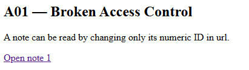

Before fixing the flaw, both notes are readable for everyone.

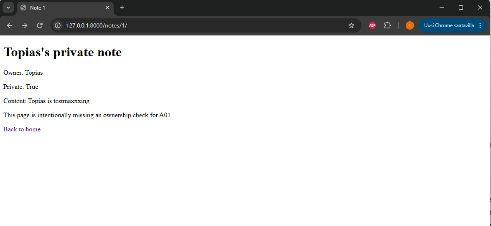
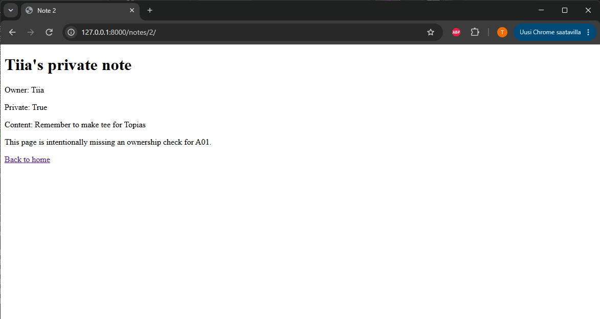

After uncommenting the fix code ([views.py lines 51-52](./src/views.py#L51)) and commenting away vulnerabile code ([views.py line 46](./src/views.py#L46)).
Neither of the notes are readable.

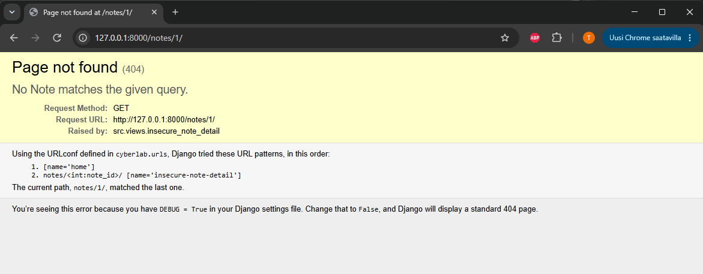
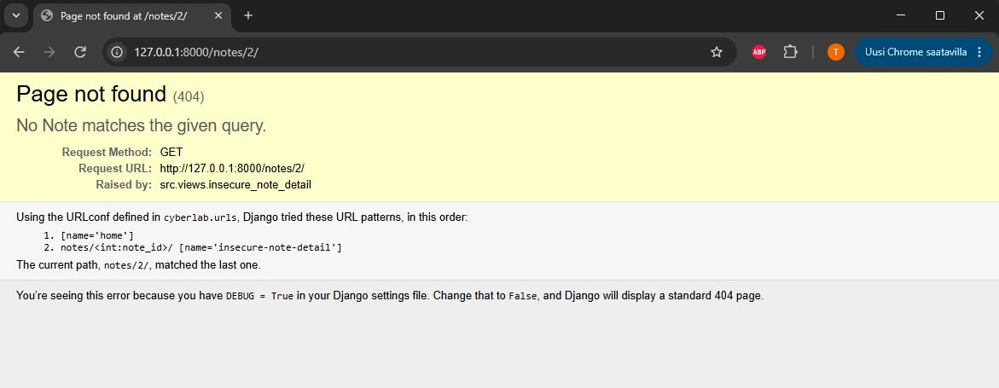 

Using "go back" in browser keeps you logged in session.

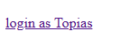

After logging is as "Topias" you are able to see only note owned by Topias.

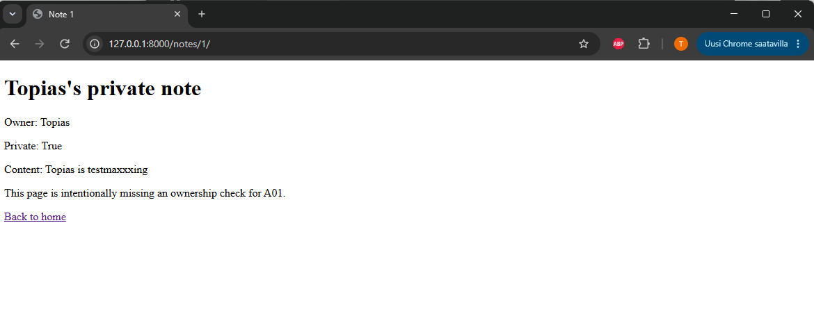

Changing number ID in url doesnt work anymore.


## A02 Cryptographic Failures

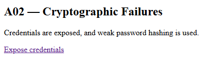

Using the link "Expose credentials" shows you all the users with their hashed passwords. 

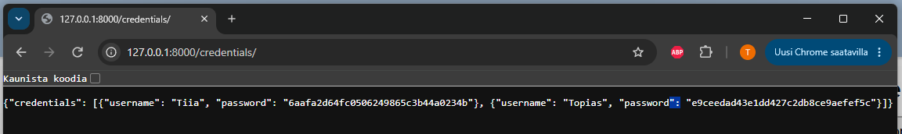

There is two issues with this exposure. weak password hashing using MD5 function. It is not viable for passwords. The second issue is that we show hashed password for user. There is an possibility that users can reverse engineer the hashed password to unhashed password.


Uncomment ([views.py lines 66-69](./src/views.py#L66)) and comment away ([views.py lines 59-61](./src/views.py#L59)) This will make sure that user will never see their hashed password.
For using tougher hashing for passwords. Uncomment ([load_sample_data.py lines 40-47](./src/management/commands/load_sample_data.py#L40)) and comment away ([load_sample_data.py lines 30-37](./src/management/commands/load_sample_data.py#L30))

Shutdown program and delete [db.sqlite3](db.sqlite3) And run 
```bash
python3 manage.py migrate
python3 manage.py load_sample_data
```

These commands will redo our database with stronger password hashing.
After running program again and Using the link "expose credentials". It will show 

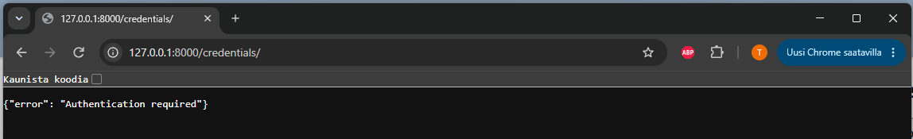

You need to login.

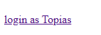

After logging in The "expose credentials will show only your username. Were using tougher password hash but we wont show it. 

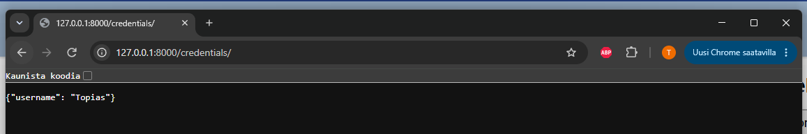

## A03 Injection

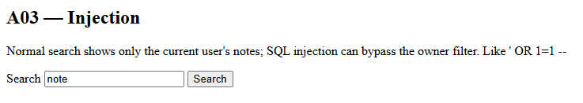
If you are logged in you will only see note owned by Topias.

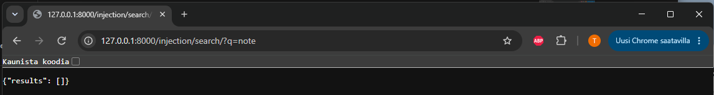

If not logged in. Use "log in as topias" link and backtrack in browser

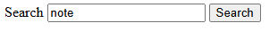

 Unless you use ' OR 1=1 --

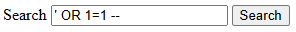

This command will show you all the notes no matter who owns it.

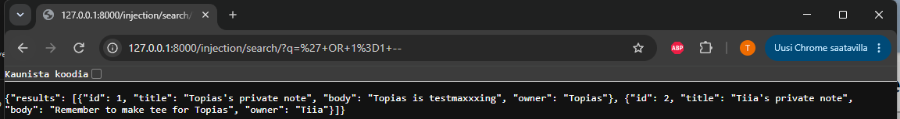

To fix this issue you must uncomment ([views.py lines 99-110](./src/views.py#L99)) and comment away ([views.py lines 82-94](./src/views.py#L82))

After using fix code 

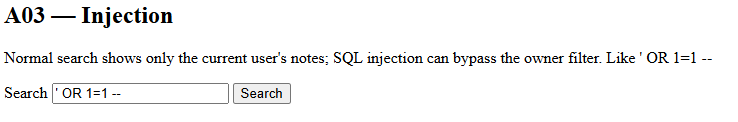

Will result

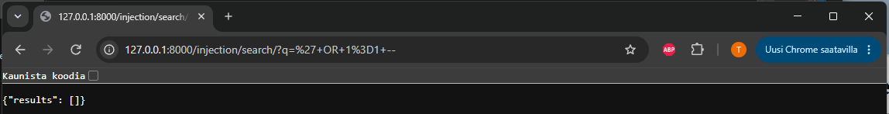

## A05 Security Misconfiguration

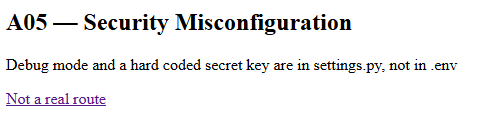

This is usual mistake made when pushing from development branch to Main. Use "Not a real route" link to see the issue.

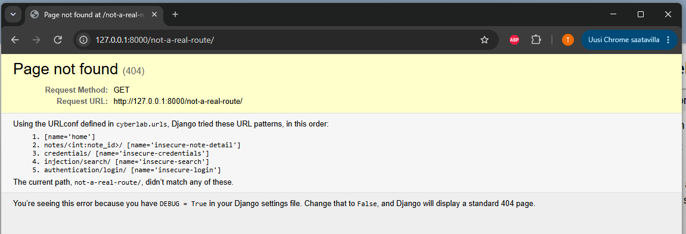

Too much data is again shown to users. But easy to fix issue. We just swap program to use .env file. Lets comment away ([settings.py lines 9-11](./cyberlab/settings.py#L9)) And uncomment ([settings.py lines 15-23](./cyberlab/settings.py#L15))

after this. shutdown program and run commands

For linux/mac

```bash
set -a
source .env
set +a
```

for windows

```powershell
# these commands lasts as long as you dont exit your terminal session.
$env:DJANGO_SECRET_KEY = "testmaxxxing"
$env:DJANGO_DEBUG = "False"
$env:DJANGO_ALLOWED_HOSTS = "127.0.0.1,localhost"
```

These commands will make program get enviroment variables from .env file. After this we can start program again.

Using the link "Not a real route" again shows a lot less to user.

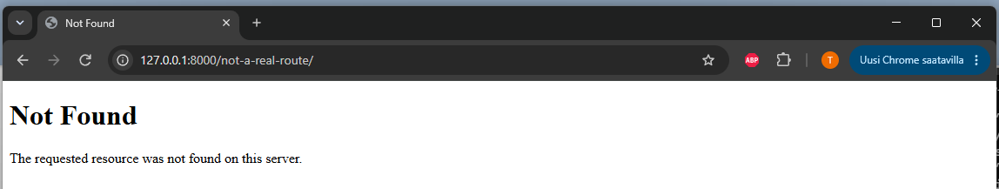


## A07 Identification and Authentication Failures

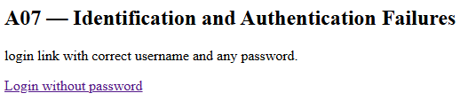

Vulnerability in login function. anyone can login if you know any used username. Only checks username not password.

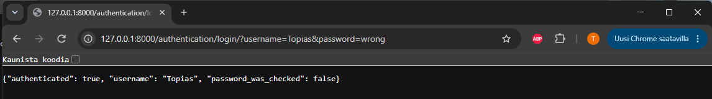

As seen "password_was_checked": false. Commenting away ([views.py lines 124-133](./src/views.py#L124)) and uncommenting ([views.py lines 139-144](./src/views.py#L139)). We activate password check.

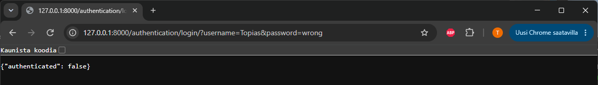

While the fix is on. 

  Does not work

Again you need shutdown program. Comment away ([load_sample_data.py lines 30-37](./src/management/commands/load_sample_data.py#L30))
And Uncomment ([load_sample_data.py lines 40-47](./src/management/commands/load_sample_data.py#L40))

Delete [db.sqlite3](db.sqlite3) And run 
```bash
python3 manage.py migrate
python3 manage.py load_sample_data
```

After running program again. Login works.


## Sources
- [Cyber Security Base Project I](https://cybersecuritybase.mooc.fi/module-3.1/)
- [Cyber Security Base installation guide](https://cybersecuritybase.mooc.fi/installation-guide/)
- [Django 3.1 tutorial, part 1](https://docs.djangoproject.com/en/3.1/intro/tutorial01/)
- [OWASP Top 10:2021](https://owasp.org/Top10/2021/)
